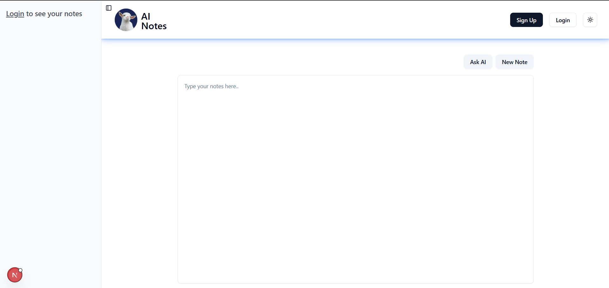
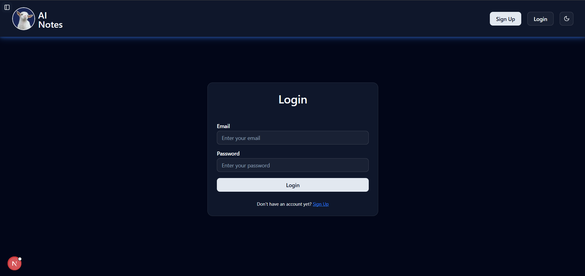
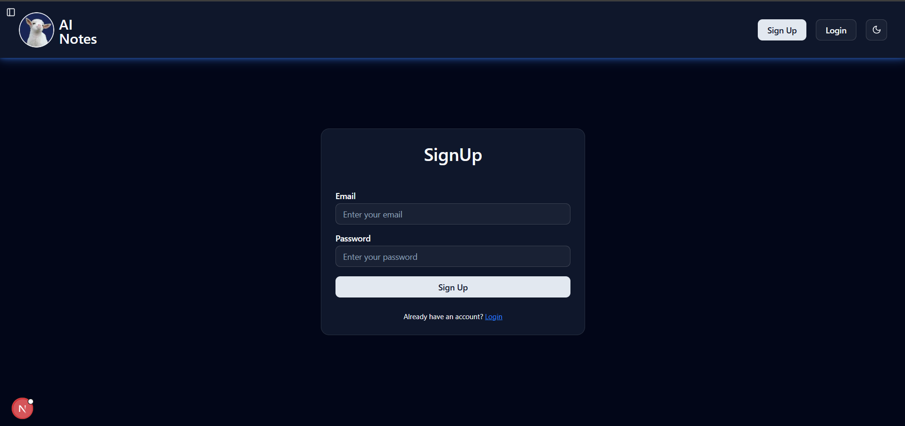

# AI Notes

AI Notes is a full-stack note-taking application with conversational AI built into the workflow. It helps users create, organize, and interact with notes using Supabase authentication, PostgreSQL storage, Prisma ORM, and OpenAI.

---

## Overview

Traditional note-taking apps keep information static. AI Notes combines note management with AI-powered interaction so users can ask questions about their notes and get context-aware answers.

The app demonstrates a modern Next.js App Router architecture, secure authentication, database-backed note CRUD, and OpenAI integration for conversational note queries.

---

## Features

* Email/password authentication with Supabase
* Create, edit, and manage personal notes
* AI-powered conversational Q&A over user notes
* Responsive UI with custom ShadCN-style components
* Type-safe database interaction via Prisma
* Server-side data fetching using Next.js App Router
* PostgreSQL-backed persistent storage
* OpenAI chat completion integration

---

## Tech Stack

### Frontend

* Next.js 15 (App Router)
* React 19
* TypeScript
* Tailwind CSS v4
* Radix UI / ShadCN-style component patterns

### Backend & Database

* Supabase authentication
* PostgreSQL
* Prisma ORM

### AI Integration

* OpenAI API (`gpt-4o-mini` chat completion)

### Deployment

* Vercel-compatible Next.js deployment

---

## Architecture Overview

### Frontend Layer

* Next.js App Router with server components
* Client-side note editing and actions
* Responsive layout with a sidebar and editor

### Backend Layer

* Supabase handles authentication and session tokens
* Prisma manages database queries and migrations
* Server actions implement note creation, updates, and AI requests

### AI Layer

* OpenAI chat completion is used to answer user questions about their stored notes
* AI responses are formatted as HTML for rendering in the UI

---

## Application Flow

1. User signs up or logs in using Supabase
2. The app lists existing notes in the sidebar
3. User creates or selects a note and edits content
4. AI queries send note context and questions to OpenAI
5. User receives concise, note-aware answers

---

## Screenshots

### Dashboard



### Login page



### Sign-up page



---

## Local Setup

### Clone repository

```bash
git clone <repository-url>
cd ai-notes
```

### Install dependencies

```bash
npm install
```

### Configure environment variables

Create a `.env` file with:

```env
DATABASE_URL=
SUPABASE_URL=
SUPABASE_ANON_KEY=
OPENAI_API_KEY=
NEXT_PUBLIC_BASE_URL=http://localhost:3000
```

### Run development server

```bash
npm run dev
```

---

## Notes

* The app uses Supabase for authentication, not a custom auth provider.
* AI functionality is focused on conversational Q&A using note content.
* There is no separate realtime subscription layer implemented today.

---

## Future Improvements

Potential enhancements:

* Dedicated note summarization workflows
* Vector search / semantic retrieval
* RAG-powered note search
* AI memory and session persistence
* Team collaboration and shared notebooks
* Role-based access control

